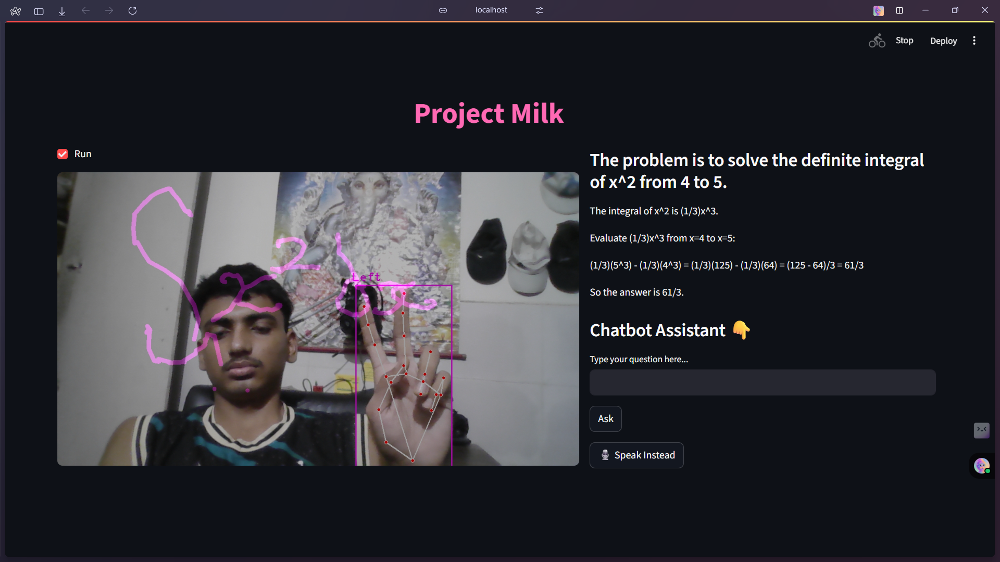

#  Project Milk -- MathBot

Project Milk is an AI-powered Streamlit app that combines hand tracking, drawing, speech, and Gemini AI to solve handwritten math problems — all in real-time.

Inspired by the legendary traditions of Yadavs and their connection to milk and buffalos 🐃, this project started as a fun idea among friends and turned into a fully functional AI assistant that can:
- Detect hand gestures to draw on screen
- Recognize index-finger writing to draw equations
- Send the handwritten input to Gemini AI for solving
- Chat with users through text (and voice locally)
- Roast users when AI can’t solve it (just for fun)

Whether you want to play around with AI or build something creative using OpenCV, MediaPipe, and Streamlit — this is for you.

###  Tech Stack:
- Python
- OpenCV + MediaPipe + CVZone
- Streamlit
- Google Generative AI (Gemini)
- SpeechRecognition (locally)
- NumPy & Pillow

> Milk was just the beginning. Now the code is flowing. 

##  Screenshot

